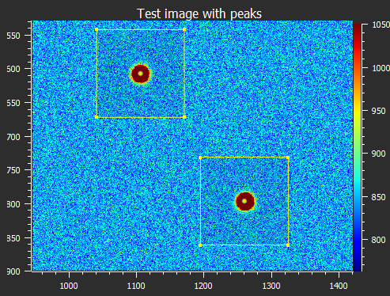
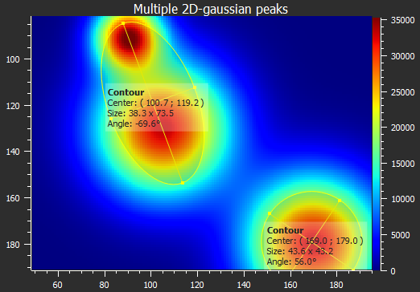
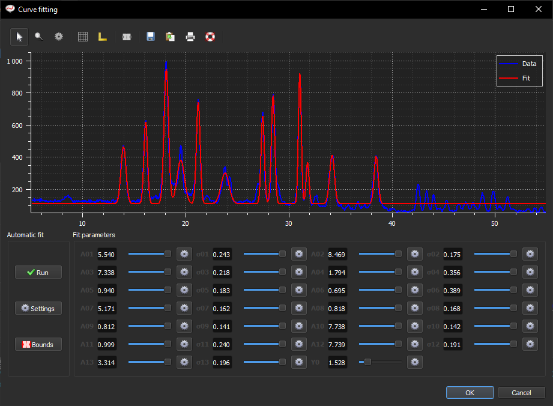

[](./LICENSE)
[](https://pypi.org/project/codraft/)
[](https://github.com/CODRA-Ingenierie-Informatique/CodraFT)
[](https://pypi.python.org/pypi/codraft/)

CodraFT is [CODRA](https://codra.net/)'s Filtering Tool.


----

## Overview

CodraFT is a generic signal and image processing software based on Python scientific
libraries (such as NumPy, SciPy or OpenCV) and Qt graphical user interfaces (thanks to
[guidata](https://pypi.python.org/pypi/guidata) and [guiqwt](https://pypi.python.org/pypi/guiqwt) libraries).

CodraFT is available as a **stand-alone** application (see for example our all-in-one Windows installer) or as an **addon to your Python-Qt application** thanks to advanced automation and embedding features.

See [documentation](https://codraft.readthedocs.io/en/latest/) for more details on
the library and [changelog](CHANGELOG.md) for recent history of changes.

### New in CodraFT 2.0

* New data processing and visualization features (see details in [changelog](CHANGELOG.md))
* Fully automated high-level processing features for internal testing purpose, as well as embedding CodraFT in a third-party software
* Extensive test suite (unit tests and application tests) with 90% feature coverage

### Credits

Copyrights and licensing:

* Copyright © 2018-2022 [CEA](http://www.cea.fr)-[CODRA](https://codra.net/), Pierre Raybaut
* Licensed under the terms of the BSD 3-Clause or the CeCILL-B License. See ``Licence_CeCILL_V2.1-en.txt``.

----

## Key features

### Data visualization

| Signal |  Image | Feature                        |
|:------:|:------:|--------------------------------|
|    •   |    •   | Screenshots (save, copy)       |
|    •   | Z-axis | Lin/log scales                 |
|    •   |    •   | Data table editing             |
|    •   |    •   | Statistics on user-defined ROI |
|    •   |    •   | Markers                        |
|        |    •   | Aspect ratio (1:1, custom)     |
|        |    •   | 50+ available colormaps        |
|        |    •   | X/Y raw/averaged profiles      |
|        |    •   | User-defined annotations       |




### Data processing

| Signal | Image | Feature                                            |
|:------:|:-----:|----------------------------------------------------|
|    •   |   •   | Multiple ROI support                               |
|    •   |   •   | Sum, average, difference, product, ...             |
|    •   |   •   | ROI extraction, Swap X/Y axes                      |
|    •   |       | Semi-automatic multi-peak detection                |
|        |   •   | Rotation (flip, rotate), resize, ...               |
|        |   •   | Flat-field correction                              |
|    •   |       | Normalize, derivative, integral                    |
|    •   |   •   | Linear calibration                                 |
|        |   •   | Thresholding, clipping                             |
|    •   |   •   | Gaussian filter, Wiener filter                     |
|    •   |   •   | Moving average, moving median                      |
|    •   |   •   | FFT, inverse FFT                                   |
|    •   |       | Interactive fit: Gauss, Lorenzt, Voigt, polynomial |
|    •   |       | Interactive multigaussian fit                      |
|    •   |   •   | Computing on custom ROI                            |
|    •   |       | FWHM, FW @ 1/e²                                    |
|        |   •   | Centroid (robust method w/r noise)                 |
|        |   •   | Minimum enclosing circle center                    |
|        |   •   | Automatic 2D-peak detection                        |
|        |   •   | Automatic contour extraction (circle/ellipse fit)  |





----

## Installation

### From the installer

CodraFT is available as a stand-alone application, which does not require any Python
distribution to be installed. Just run the installer and you're good to go!

The installer package is available in the [Releases](https://github.com/CODRA-Ingenierie-Informatique/CodraFT/releases) section.

### From the source package

```bash
python setup.py install
```

----

## Dependencies

### Requirements

* Python 3.7+ (reference is Python 3.8)
* [PyQt5](https://pypi.python.org/pypi/PyQt5) (Python Qt bindings)
* [QtPy](https://pypi.org/project/QtPy/) (abstraction layer for Python-Qt binding libraries)
* [guidata](https://pypi.python.org/pypi/guidata) (set of tools for automatic GUI generation)
* [guiqwt](https://pypi.python.org/pypi/guiqwt) (set of tools for curve and image plotting based on guidata)
* [h5py](https://pypi.org/project/h5py/) (interface to the HDF5 data format)
* [NumPy](https://pypi.org/project/numpy/) (operations on multidimensional arrays)
* [SciPy](https://pypi.org/project/scipy/) (algorithms for scientific computing)
* [scikit-image](https://pypi.org/project/scikit-image/) (algorithms for image processing)
* [psutil](https://pypi.org/project/psutil/) (process and system monitoring)

### Other optional modules

* [OpenCV](https://pypi.org/project/opencv-python/) for some image processing features
